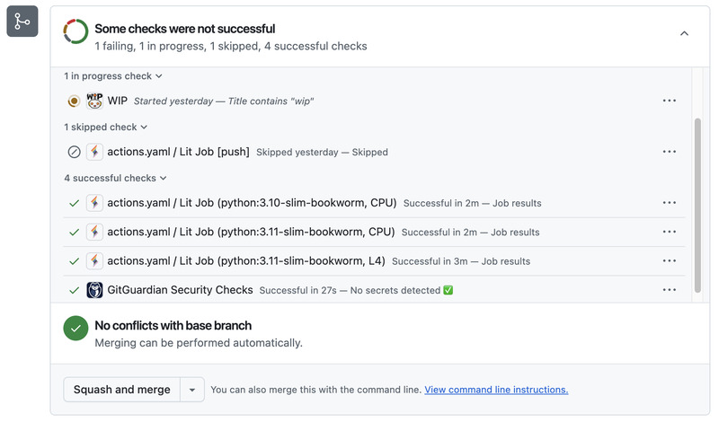

# Python GitHub Bot

A comprehensive GitHub App that automates pull request validation and continuous integration using Lightning's distributed compute platform and configurable YAML workflows.

## Overview

This bot provides automated code quality assurance and testing for your GitHub repositories by:

- **🔍 Automated Validation**: Runs comprehensive checks on both pull requests and push events using configurable YAML workflows
- **🎛️ Flexible Triggers**: Configure workflows to run on specific events (push, pull_request) and branches based on your filtering criteria
- **🔄 Rerun Failed Checks**: Easily retry failed validations by clicking the "Re-run" button on GitHub check runs
- **⚡ Lightning-Powered Execution**: Leverages Lightning's distributed compute platform for fast, scalable test execution across multiple environments
- **🎯 Multi-Environment Testing**: Supports testing across different Python versions, operating systems, and hardware configurations (CPU/GPU)
- **📋 Configurable Workflows**: Define custom validation pipelines using simple YAML configuration files with trigger-based filtering
- **💰 Cost-Effective**: Pay-per-use model with spot instance support for cost optimization
- **🔒 Secure**: Uses GitHub App authentication for secure repository access

______________________________________________________________________

_This project is inspired by [building github bots](https://www.linkedin.com/learning/building-github-bots) on LinkedIn Learning._
